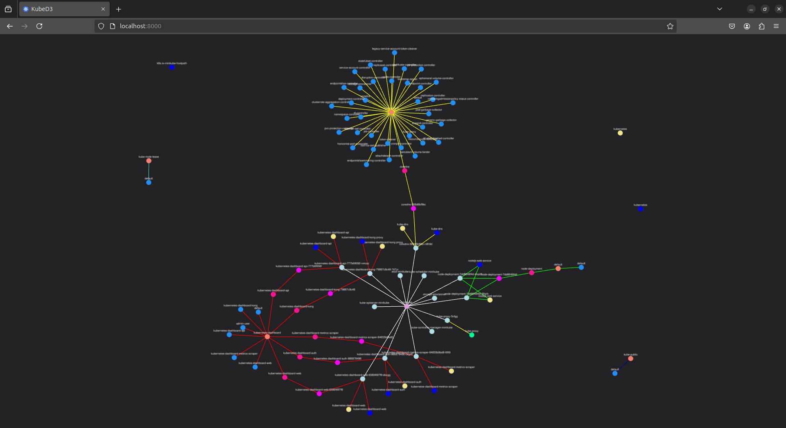

# Kube-D3

Kubernetes graph visualizer

## Demo

## TODO

- Port to SvelteKit
- Frontend with selectors for
  - Rules
  - Types
- New backend for handling rules & types to show
- Rules module in own files
- Color scheme options

## Kubernetes objects support

Support types:
 - None: is completely ignored
 - Full: displayed in graph as expected
 - Implicit: implicitly displayed in graph (for example `RoleBindings`: are resolved to a link between `Role` and `Subject`)
 - Planned: not yet supported, but planned as a future feature

| **SUPPORT**  | OBJECT                           | API                               | NAMESPACED |
|--------------|----------------------------------|-----------------------------------|------------|
| None         | Binding                          | v1                                | true       |
| None         | ComponentStatus                  | v1                                | false      |
| None         | ConfigMap                        | v1                                | true       |
| **Full**     | Endpoints                        | v1                                | true       |
| None         | Event                            | v1                                | true       |
| None         | LimitRange                       | v1                                | true       |
| **Full**     | Namespace                        | v1                                | false      |
| **Full**     | Node                             | v1                                | false      |
| None         | PersistentVolumeClaim            | v1                                | true       |
| None         | PersistentVolume                 | v1                                | false      |
| **Full**     | Pod                              | v1                                | true       |
| None         | PodTemplate                      | v1                                | true       |
| **Full**     | ReplicationController            | v1                                | true       |
| None         | ResourceQuota                    | v1                                | true       |
| None         | Secret                           | v1                                | true       |
| **Full**     | ServiceAccount                   | v1                                | true       |
| **Full**     | Service                          | v1                                | true       |
| None         | MutatingWebhookConfiguration     | admissionregistration.k8s.io/v1   | false      |
| None         | ValidatingAdmissionPolicy        | admissionregistration.k8s.io/v1   | false      |
| None         | ValidatingAdmissionPolicyBinding | admissionregistration.k8s.io/v1   | false      |
| None         | ValidatingWebhookConfiguration   | admissionregistration.k8s.io/v1   | false      |
| None         | CustomResourceDefinition         | apiextensions.k8s.io/v1           | false      |
| None         | APIService                       | apiregistration.k8s.io/v1         | false      |
| None         | ControllerRevision               | apps/v1                           | true       |
| **Full**     | DaemonSet                        | apps/v1                           | true       |
| **Full**     | Deployment                       | apps/v1                           | true       |
| **Full**     | ReplicaSet                       | apps/v1                           | true       |
| **Full**     | StatefulSet                      | apps/v1                           | true       |
| None         | SelfSubjectReview                | authentication.k8s.io/v1          | false      |
| None         | TokenReview                      | authentication.k8s.io/v1          | false      |
| None         | LocalSubjectAccessReview         | authorization.k8s.io/v1           | true       |
| None         | SelfSubjectAccessReview          | authorization.k8s.io/v1           | false      |
| None         | SelfSubjectRulesReview           | authorization.k8s.io/v1           | false      |
| None         | SubjectAccessReview              | authorization.k8s.io/v1           | false      |
| None         | HorizontalPodAutoscaler          | autoscaling/v2                    | true       |
| None         | CronJob                          | batch/v1                          | true       |
| **Full**     | Job                              | batch/v1                          | true       |
| None         | CertificateSigningRequest        | certificates.k8s.io/v1            | false      |
| None         | IngressClassParameters           | configuration.konghq.com/v1alpha1 | true       |
| None         | KongClusterPlugin                | configuration.konghq.com/v1       | false      |
| None         | KongConsumerGroup                | configuration.konghq.com/v1beta1  | true       |
| None         | KongConsumer                     | configuration.konghq.com/v1       | true       |
| None         | KongCustomEntity                 | configuration.konghq.com/v1alpha1 | true       |
| None         | KongIngress                      | configuration.konghq.com/v1       | true       |
| None         | KongLicense                      | configuration.konghq.com/v1alpha1 | false      |
| None         | KongPlugin                       | configuration.konghq.com/v1       | true       |
| None         | KongUpstreamPolicy               | configuration.konghq.com/v1beta1  | true       |
| None         | KongVault                        | configuration.konghq.com/v1alpha1 | false      |
| None         | TCPIngress                       | configuration.konghq.com/v1beta1  | true       |
| None         | UDPIngress                       | configuration.konghq.com/v1beta1  | true       |
| None         | Lease                            | coordination.k8s.io/v1            | true       |
| None         | EndpointSlice                    | discovery.k8s.io/v1               | true       |
| None         | Event                            | events.k8s.io/v1                  | true       |
| None         | FlowSchema                       | flowcontrol.apiserver.k8s.io/v1   | false      |
| None         | PriorityLevelConfiguration       | flowcontrol.apiserver.k8s.io/v1   | false      |
| None         | IngressClass                     | networking.k8s.io/v1              | false      |
| None         | Ingress                          | networking.k8s.io/v1              | true       |
| None         | NetworkPolicy                    | networking.k8s.io/v1              | true       |
| None         | RuntimeClass                     | node.k8s.io/v1                    | false      |
| None         | PodDisruptionBudget              | policy/v1                         | true       |
| **Implicit** | ClusterRoleBinding               | rbac.authorization.k8s.io/v1      | false      |
| **Full**     | ClusterRole                      | rbac.authorization.k8s.io/v1      | false      |
| **Implicit** | RoleBinding                      | rbac.authorization.k8s.io/v1      | true       |
| **Full**     | Role                             | rbac.authorization.k8s.io/v1      | true       |
| None         | PriorityClass                    | scheduling.k8s.io/v1              | false      |
| None         | CSIDriver                        | storage.k8s.io/v1                 | false      |
| None         | CSINode                          | storage.k8s.io/v1                 | false      |
| None         | CSIStorageCapacity               | storage.k8s.io/v1                 | true       |
| None         | StorageClass                     | storage.k8s.io/v1                 | false      |
| None         | VolumeAttachment                 | storage.k8s.io/v1                 | false      |
