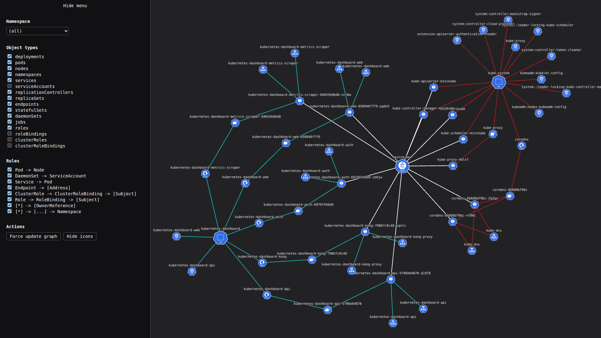
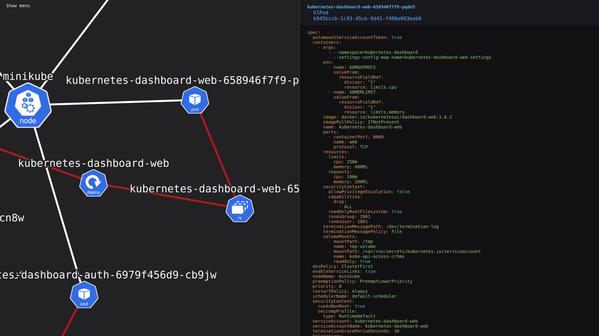

# Kubernetes-Graph-Visualizer

WebGL accelerated kubernetes cluster visualization, powered by [`cytoscape`](https://js.cytoscape.org/).


## Examples




(Graph without Icons)


## Colors, icons & links

Nodes are normally displayed as their respective type icon, but these icons can also be disabled. 
When disabled, nodes are color-coded by their types (for example, all `pods` in the screenshot above are colored cyan).

Links between nodes are created according to rules, which can be toggled in the UI.
These links are color-coded depending on namespaces, with non-namespaced links being white.


## Usage

Create a production build using npm:
```sh
npm run build
```

Run the build with Node.js:
```sh
ORIGIN=http://localhost:8000 PORT=8000 node build
```

The GUI should be accessible under [`http://localhost:8000/gui`](http://localhost:8000/gui).

Per default, the kubernetes API server configured in `~/.kube/config` will be used.
For advanced usage (such as exposing the server on your network) see the [node-adapter](https://svelte.dev/docs/kit/adapter-node) docs.


## Future roadmap

- Support for other types of objects
- Rule improvements
  - Job
  - CronJob
  - ConfigMap
  - ...


## Kubernetes objects support

| **SUPPORT** | OBJECT                           | API                               | NAMESPACED | ICON                                                                                                                                   |
|-------------|----------------------------------|-----------------------------------|------------|----------------------------------------------------------------------------------------------------------------------------------------|
| **Yes**     | Endpoints                        | v1                                | true       |                    |
| **Yes**     | Namespace                        | v1                                | false      |                    |
| **Yes**     | Node                             | v1                                | false      |  |
| **Yes**     | Pod                              | v1                                | true       |                   |
| **Yes**     | ReplicationController            | v1                                | true       |                    |
| **Yes**     | ServiceAccount                   | v1                                | true       |                    |
| **Yes**     | Service                          | v1                                | true       |                   |
| **Yes**     | Secret                           | v1                                | true       |                |
| **Yes**     | ConfigMap                        | v1                                | true       |                    |
| **Yes**     | DaemonSet                        | apps/v1                           | true       |                    |
| **Yes**     | Deployment                       | apps/v1                           | true       |                |
| **Yes**     | ReplicaSet                       | apps/v1                           | true       |                    |
| **Yes**     | StatefulSet                      | apps/v1                           | true       |                   |
| **Yes**     | Job                              | batch/v1                          | true       |                   |
| **Yes**     | CronJob                          | batch/v1                          | true       |               |
| **Yes**     | ClusterRoleBinding               | rbac.authorization.k8s.io/v1      | false      |                   |
| **Yes**     | ClusterRole                      | rbac.authorization.k8s.io/v1      | false      |                |
| **Yes**     | RoleBinding                      | rbac.authorization.k8s.io/v1      | true       |                    |
| **Yes**     | Role                             | rbac.authorization.k8s.io/v1      | true       |                  |
| **Yes**     | CustomResourceDefinition         | apiextensions.k8s.io/v1           | false      |                   |
| No          | Binding                          | v1                                | true       |                                                                                                                                        |
| No          | ComponentStatus                  | v1                                | false      |                                                                                                                                        |
| No          | Event                            | v1                                | true       |                                                                                                                                        |
| No          | LimitRange                       | v1                                | true       |                                                                                                                                        |
| No          | PersistentVolumeClaim            | v1                                | true       |                                                                                                                                        |
| No          | PersistentVolume                 | v1                                | false      |                                                                                                                                        |
| No          | PodTemplate                      | v1                                | true       |                                                                                                                                        |
| No          | ResourceQuota                    | v1                                | true       |                                                                                                                                        |
| No          | MutatingWebhookConfiguration     | admissionregistration.k8s.io/v1   | false      |                                                                                                                                        |
| No          | ValidatingAdmissionPolicy        | admissionregistration.k8s.io/v1   | false      |                                                                                                                                        |
| No          | ValidatingAdmissionPolicyBinding | admissionregistration.k8s.io/v1   | false      |                                                                                                                                        |
| No          | ValidatingWebhookConfiguration   | admissionregistration.k8s.io/v1   | false      |                                                                                                                                        |
| No          | APIService                       | apiregistration.k8s.io/v1         | false      |                                                                                                                                        |
| No          | ControllerRevision               | apps/v1                           | true       |                                                                                                                                        |
| No          | SelfSubjectReview                | authentication.k8s.io/v1          | false      |                                                                                                                                        |
| No          | TokenReview                      | authentication.k8s.io/v1          | false      |                                                                                                                                        |
| No          | LocalSubjectAccessReview         | authorization.k8s.io/v1           | true       |                                                                                                                                        |
| No          | SelfSubjectAccessReview          | authorization.k8s.io/v1           | false      |                                                                                                                                        |
| No          | SelfSubjectRulesReview           | authorization.k8s.io/v1           | false      |                                                                                                                                        |
| No          | SubjectAccessReview              | authorization.k8s.io/v1           | false      |                                                                                                                                        |
| No          | HorizontalPodAutoscaler          | autoscaling/v2                    | true       |                                                                                                                                        |
| No          | CertificateSigningRequest        | certificates.k8s.io/v1            | false      |                                                                                                                                        |
| No          | IngressClassParameters           | configuration.konghq.com/v1alpha1 | true       |                                                                                                                                        |
| No          | KongClusterPlugin                | configuration.konghq.com/v1       | false      |                                                                                                                                        |
| No          | KongConsumerGroup                | configuration.konghq.com/v1beta1  | true       |                                                                                                                                        |
| No          | KongConsumer                     | configuration.konghq.com/v1       | true       |                                                                                                                                        |
| No          | KongCustomEntity                 | configuration.konghq.com/v1alpha1 | true       |                                                                                                                                        |
| No          | KongIngress                      | configuration.konghq.com/v1       | true       |                                                                                                                                        |
| No          | KongLicense                      | configuration.konghq.com/v1alpha1 | false      |                                                                                                                                        |
| No          | KongPlugin                       | configuration.konghq.com/v1       | true       |                                                                                                                                        |
| No          | KongUpstreamPolicy               | configuration.konghq.com/v1beta1  | true       |                                                                                                                                        |
| No          | KongVault                        | configuration.konghq.com/v1alpha1 | false      |                                                                                                                                        |
| No          | TCPIngress                       | configuration.konghq.com/v1beta1  | true       |                                                                                                                                        |
| No          | UDPIngress                       | configuration.konghq.com/v1beta1  | true       |                                                                                                                                        |
| No          | Lease                            | coordination.k8s.io/v1            | true       |                                                                                                                                        |
| No          | EndpointSlice                    | discovery.k8s.io/v1               | true       |                                                                                                                                        |
| No          | Event                            | events.k8s.io/v1                  | true       |                                                                                                                                        |
| No          | FlowSchema                       | flowcontrol.apiserver.k8s.io/v1   | false      |                                                                                                                                        |
| No          | PriorityLevelConfiguration       | flowcontrol.apiserver.k8s.io/v1   | false      |                                                                                                                                        |
| No          | IngressClass                     | networking.k8s.io/v1              | false      |                                                                                                                                        |
| No          | Ingress                          | networking.k8s.io/v1              | true       |                                                                                                                                        |
| No          | NetworkPolicy                    | networking.k8s.io/v1              | true       |                                                                                                                                        |
| No          | RuntimeClass                     | node.k8s.io/v1                    | false      |                                                                                                                                        |
| No          | PodDisruptionBudget              | policy/v1                         | true       |                                                                                                                                        |
| No          | PriorityClass                    | scheduling.k8s.io/v1              | false      |                                                                                                                                        |
| No          | CSIDriver                        | storage.k8s.io/v1                 | false      |                                                                                                                                        |
| No          | CSINode                          | storage.k8s.io/v1                 | false      |                                                                                                                                        |
| No          | CSIStorageCapacity               | storage.k8s.io/v1                 | true       |                                                                                                                                        |
| No          | StorageClass                     | storage.k8s.io/v1                 | false      |                                                                                                                                        |
| No          | VolumeAttachment                 | storage.k8s.io/v1                 | false      |                                                                                                                                        |


<!--
Icons for future use


-->
